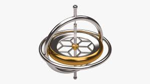

# Proyecto Final - Computación visual  
## Integrantes
- Daniel Suárez
- Marcelo Escamilla
## Introducción
La matematica es una herramienta que es de gran utilidad para sel ser humano. Sin embargo, esta puede llegar a ser muy abstracta y su enseñanza se resume a memorizar formulas y definiciones. Un campo de la matematica, el algebra lineal, es ampliamente usado en computación visual. Con este proyecto buscamos retomar algunos temas de esta rama de la matematica y visualizarlos para crear una herramienta de enzeñanza dinamica.

## Objetivo
1. Campos vectoriales: Como principal objetivo se tiene el investigar y probar multiples formas de generar campos vectoriales y sus usos. 
2. Bloqueo de Cardán: Visualizar las limitaciones en la orientación y el desplazamiento angular de un objeto usando angulos de Euler.

# Campos vectoriales

## Diseño
Se crean puntos en un plano con un rango determinado \[-5,5], se dibujan. Para cada punto se calcula el vector en el campo. Se escalan los vectores con determinadas caracterisitas y coordenadas del punto. Entonces, dadas las coordenadas de un punto en particular, se le realizan determinadas operaciones de transformación para así obener el vector resultante. 

Campo vectorial como lo conocemos normalmente:  

#### Resultado 

# Bloqueo de Cardán

## Diseño
utilizando la libreria nub, creamos un giroscopio. Este consiste de cinco nodos: El primero es el nodo de referencia, los tres siguientes representan un rotor del giroscopio y el ultimo representa un objeto que cambia de orientacion acorde a los rotores. 

Al igual que un giroscopio real, cada nodo depende del nodo exterior, hasta llegar al objeto que depende de todos los nodos. Se agrego interactividad por medio de teclas y del mouse para que el usuario pueda explorar el sistema de tres grados de libertad.

El sistema emula angulos de Euler: Una manera bastante intuitiva de definir un desplazamiento angular usando un conjunto de tres angulos. En este ejemplo, cada rotor del sistema de color rojo, verde y azul representa uno de estos angulos.

Si bien esta es una de las formas mas faciles de representar un desplazamiento angular (en comparación con las matrices y cuaterniones) tiene sus complicaciones. Debido a la naturaleza ciclica de los angulos, para un desplazamiento se tienen multiples ternas de angulos que lo representan.

otro problema, el cual se busca visualizar en el sistema es el "bloqueo de Cardán" lo cual consiste en la perdida de un grado de libertad cuando dos de los rotores se encuentran en paralelo. Esto hace que el sistema solo pueda moverse en dos dimensiones mientras los dos rotores estan en paralelo.

### Resultado

## Conlusiones

- La visualización es una herramienta que se utiliza poco a la hora de enseñar. Poder observar e interactuar con una idea es una experiencia que refuerza el aprendizaje. Igualmente, crear visualizaciones es una manera de recordar temas aprendidos y afianzar los conceptos.

- El acceso a herramientas de programación de alto nivel permiten el desarrollo veloz de proyectos. Processing abstrae muchos de las configuraciones y nimiedades de Java y permite enfocarse en explorar ideas. La libreria Nub nos ofrece objetos de alto nivel que facilitan la creación y manipulación de elementos en 3D.

