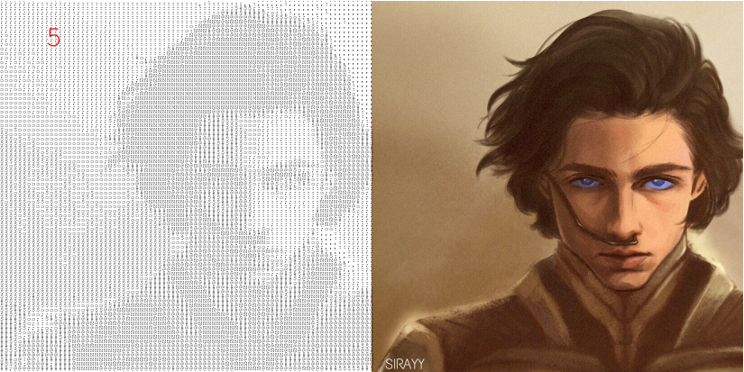
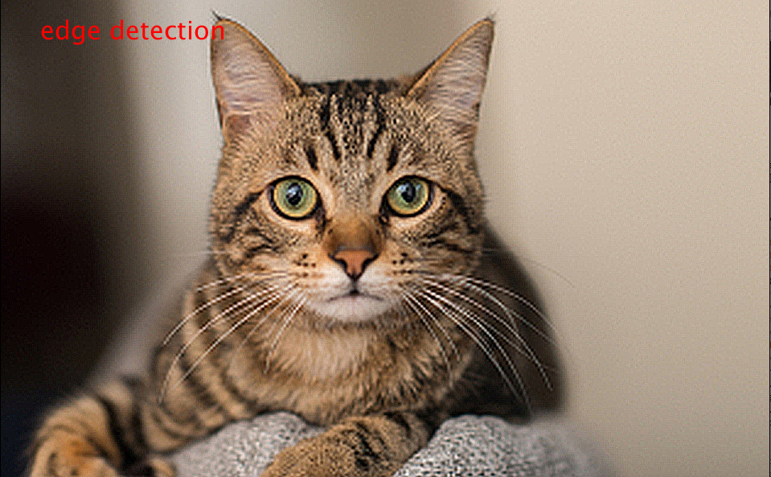
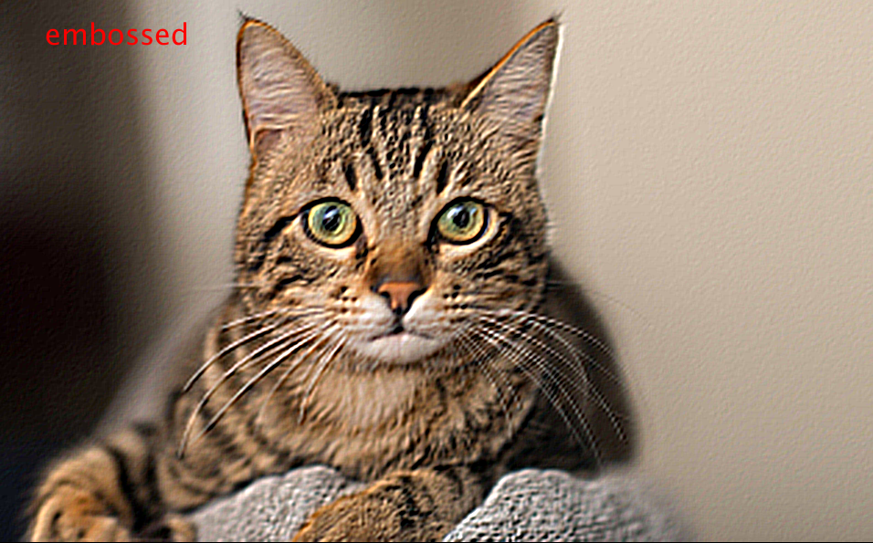
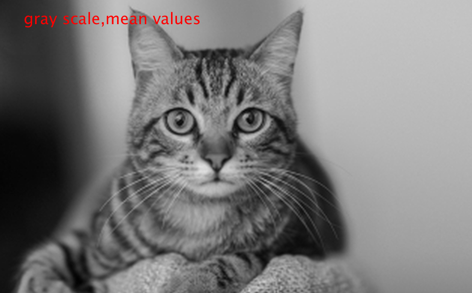
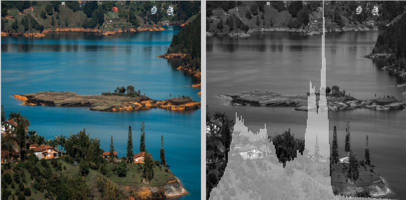
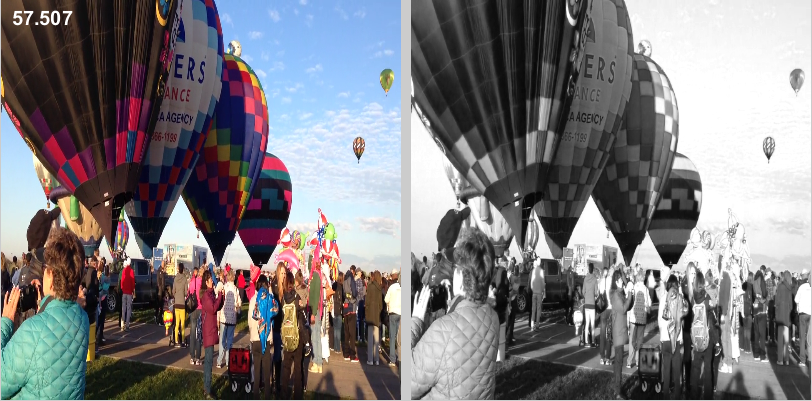

# Taller: Procesamiento de imágenes 
## Integrantes
- Daniel Suárez
- Marcelo Escamilla
## Motivación
El procesamiento de imagenes en general como una técnica que se aplica a las imagenes,digitales para mejorar el rendimiento de algunas características, extraer mayor información, o incluso tener una salida diferente luego de aplicarle algunas características o procedimientos. Sus resultados en la investigación y académia han traido importantes ayudas como son: 
- Mejoras en la calidad de imagenes en la percepción humana. Filtrado de ruido, filtros, iluminación, contraste. 
- Procesamiento de imagenes para visión por computador, extrayendo caracterisiticas importantes y mayor información. 
- Transmisión, almacenamiento y compresión de imagenes. 
## Objetivo
Implementar diversas soluciones para el procesamiento de imagenes y video, aplicando transformaciones y diversas ténicas para ello.
## Metodología
En el campo del procesamiento de imagenes, un factor importante es entender como se representan realmente las imagenes, es aquí donde el algebra lineal y sus bases nos ayudan a entender como una *matriz bidimensional* representan la intensidad de la luz y la reflectividad de la superficie. Para este taller, se implementaron distintas tecnias tanto en imágenes como en video.

### Conversión a ascii
**Descripción:** Implementacion por software para generar una imagen con caracteres ascii. Muestra una ventana con la imagen original a la derecha y la imagen ascii a la izquierda. Se puede usar las flechas arriba y abajo para cambiar la precisión de la imagen ascii.
#### Resultado

### Filtros
**Descripción:**  Implementacion por software para generar imágenes en escala de grises y algunas mascaras de convolucion (*repujado y detección de bordes*) Se puede navegar por los filtros implementados con las flechas arriba y abajo. El nombre del filtro se imprime en la esquina superior izquierda.
#### Resultado

### Despliegue de Histograma en imagen
**Descripción:** Se muestra un histograma en la imagen resultante junto con un filtro, con la segmentación interactiva reflejada en la imagen, al hacer click sobre el histograma y mover el mouse se selecciona el único segmento de pixeles que se quiere pintar de la imagen.
#### Resultado

### Medición de eficacia computacional.
**Descripción:** Implementacion por software para generar video en escala de grises y medición de FPS.
#### Resultado

## Conlusiones

El procesamiento de imagenes y video nos brinda un panorama grande en cuanto a aprendizaje se refiere, ya que no solo entendemos como se procesa una imagen o como se dibuja en la pantalla, tambien entender como desde la investigación y academía se ha podido entregar herramientas y ayudas a otras áreas del conocimiento y profesiones, como es el caso de la fotografía y producción audiovisual. Las transformaciones en las imagenes las tenemos día a día, ya sea con un filtro en instagram, o editando la iluminación de nuestra foto de atardecer o un video. Ademas, la información util que podemos sacar de una imagen y brindarle más ayudas al fotografo o diseñador.

En resumen, entiendo más sobre las imágenes, podemos desarrollar mucho más en cuanto a gráficos por computador y el ámplio mundo que le rodea. 
